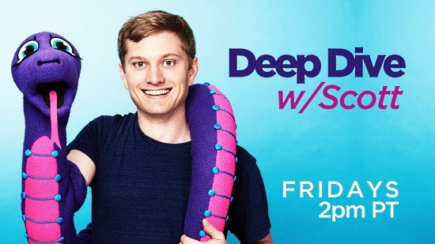

# Deep Dive w/Scott

## Schedule
Deep Dive happens every week. Normally Fridays at 2pm Pacific but occasionally
shifted to Thursday at 2pm. Typically goes for two hours or more. Questions are
welcome.

## Fetch and Format Episodes notes with `create_episode_notes.py`

Script now works from YT as the source of the notes and creates a well formatted
(if we're lucky) markdown file from those notes to be commited to the Deep Dive
repo.

The scripts will look for the following patterns to create timestamp links:
`#:##:##` or `##:##` or `#:##`
Example YT URL: `https://www.youtube.com/watch?v=VIDEO_ID&t=seconds`

Examples:
`python create_episode_notes VIDEO_ID`
>VIDEO_ID is the YT video parameter from the watch url v=VIDEO_ID
